# Basic Shading

Displays a circular shape that is shaded using the Phong Illumination Model.
The skeleton was from [Fall 2016 UC Berkeley CS184/284A Foundations of Computer Graphics](ps://inst.eecs.berkeley.edu/~cs184/fa16/assignments.html)

## Examples
* An image showing diffuse only shading from a single directional light source. (-kd 0.5 0.5 0.5 -dl -1 -1 -1 1 1 1)
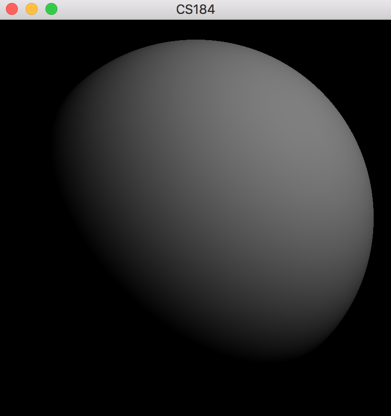

* An image showing diffuse only shading from a single point light source. (-kd 0.5 0.5 0.5 -pl 1 0 1 0 1 0)
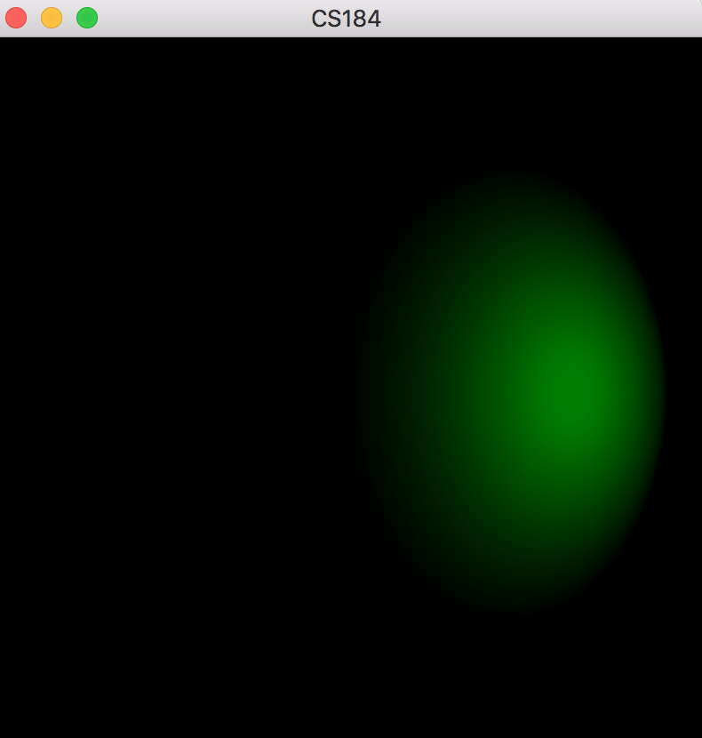

* An image showing specular only shading from a single point light source. (-ks 0.5 0.5 0.5 -pl 1 0 1 1 1 1 )
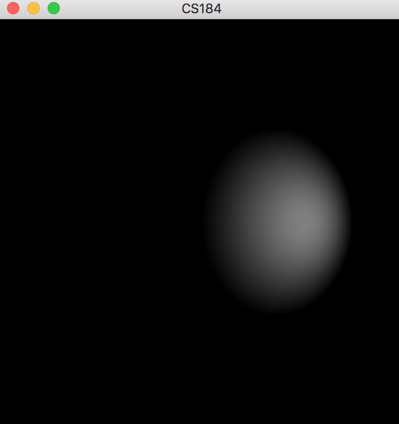

* An image showing specular only shading from a single directional light source. (-ks 0.5 0.5 0.5 -dl -1 -1 -1 1 1 1)
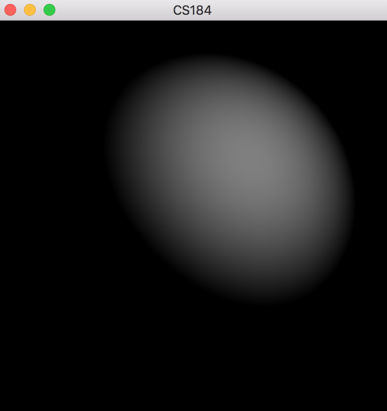

* An image showing combined specular and diffuse shading with only one directional light source. (-ks 0.5 0.5 0.5 -kd 0.5 0.5 0.5 -dl -1 -1 -1 1 1 1)
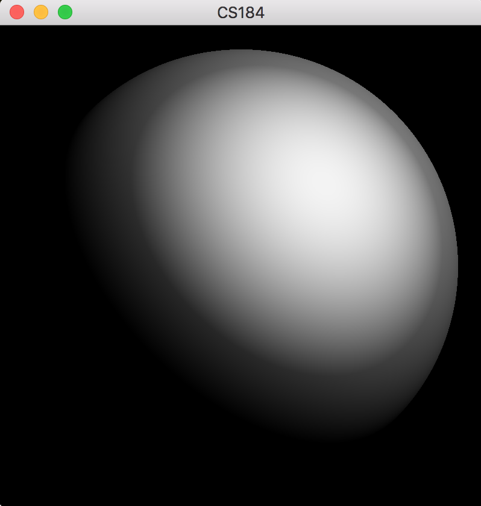

* An image showing combined specular and diffuse shading with one directional light source and one point light source. (-ks 0.5 0.5 0.5 -kd 0.5 0.5 0.5 -dl -1 -1 -1 1 1 1 -pl 1 0 1 0.8 0.2 0.8)
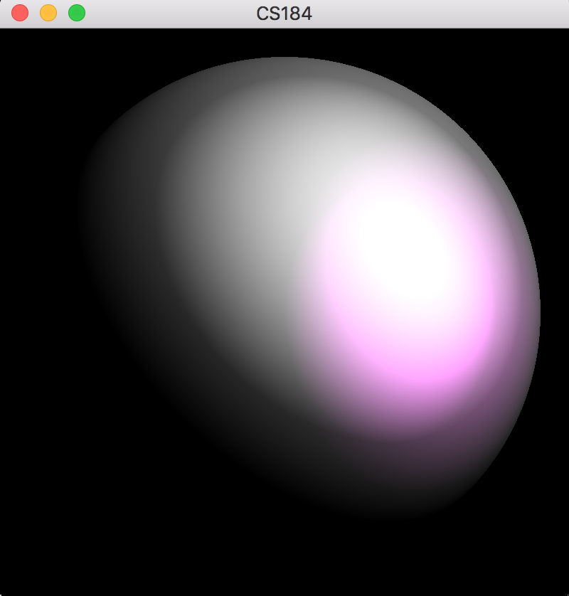

* An image showing combined specular and diffuse shading with one directional light source and one point light source on an isotropic material. (-ks 0.5 0.5 0.5 -kd 0.5 0.5 0.5 -dl -1 -1 -1 1 1 1 -pl 1 0 1 0.8 0.2 0.8 -sp 300)
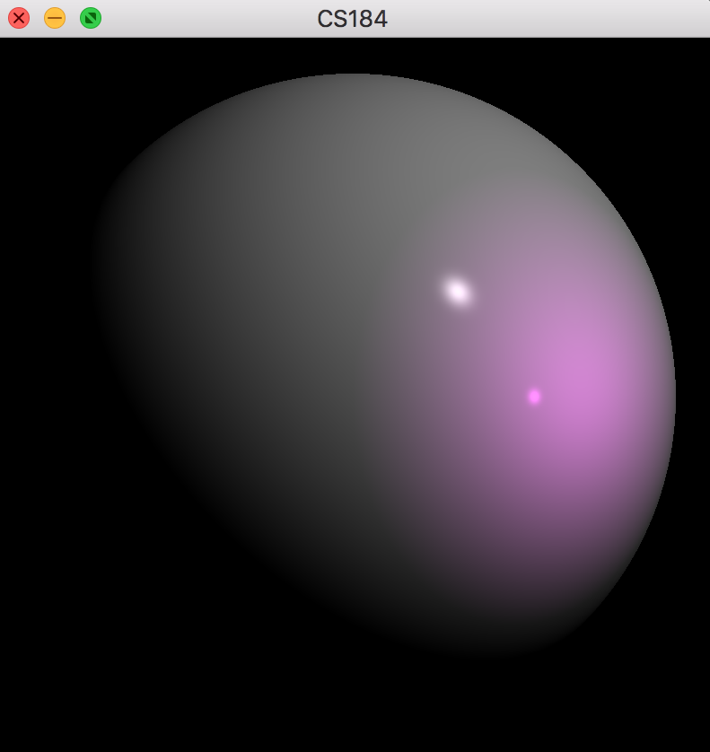

* An image showing combined specular and diffuse shading with one directional light source and one point light source on an anisotrophic material. (-ks 0.5 0.5 0.5 -kd 0.5 0.5 0.5 -dl -1 -1 -1 1 1 1 -pl 1 0 1 0.8 0.2 0.8 -sp 2 -spu 10 -spv 100)
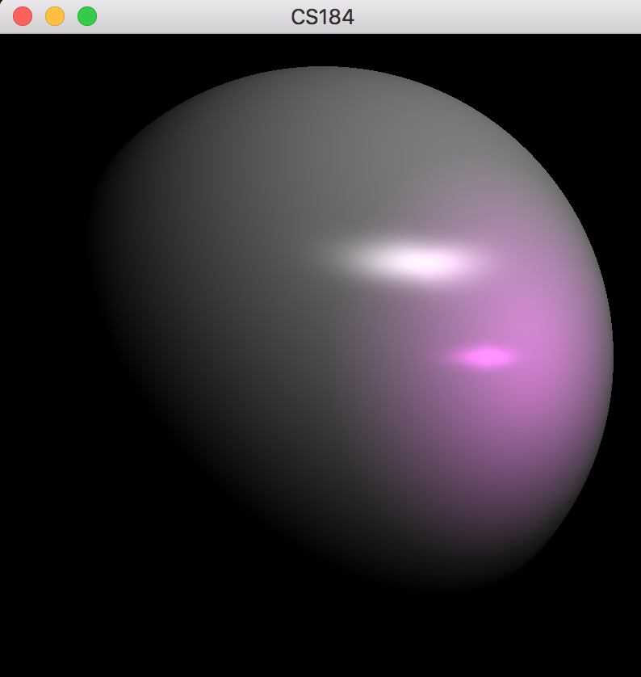

* An image showing combined specular and diffuse shading with one directional light source and one point light source on an anisotrophic material. (-ks 0.5 0.5 0.5 -kd 0.5 0.5 0.5 -dl -1 -1 -1 1 1 1 -pl 1 0 1 0.8 0.2 0.8 -sp 2 -spu 100 -spv 10)
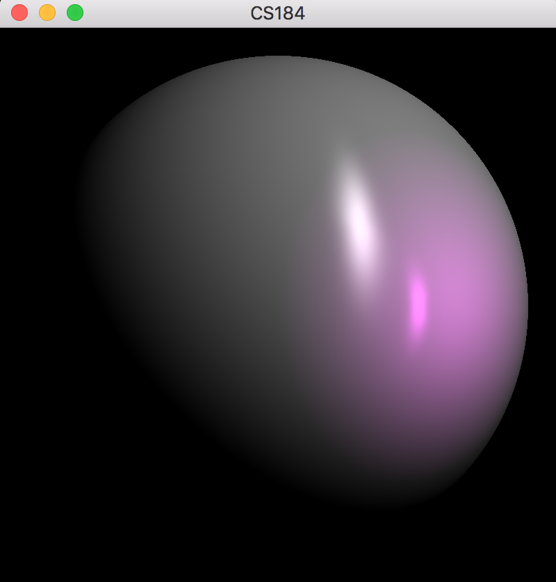

* An image showing combined specular and diffuse shading with one directional light source and two point light source on an isotrophic material. (-ks 0.5 0.5 0.5 -kd 0.5 0.5 0.5 -dl -1 -1 -1 1 1 1 -pl 1 0 1 0.8 0.2 0.8 -sp 2 -pl -1 -1 1 0.5 0.6 0.9)
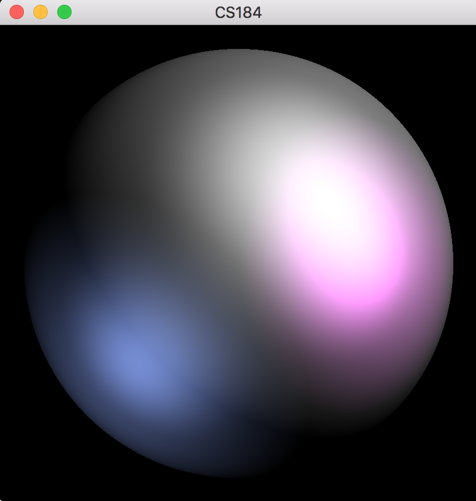

* An image showing combined specular and diffuse shading with one directional light source and two point light source on an isotrophic material (larger sp value). (-kd 0.5 0.5 0.5 -ks 0.5 0.5 0.5 -dl -1 -1 -1 0.2 0.2 0.7 -sp 250 -ka 0.1 0.2 0.1 -pl -1 1 1 1 1 1 -pl 1 -1 1 0 0.2 0.5)
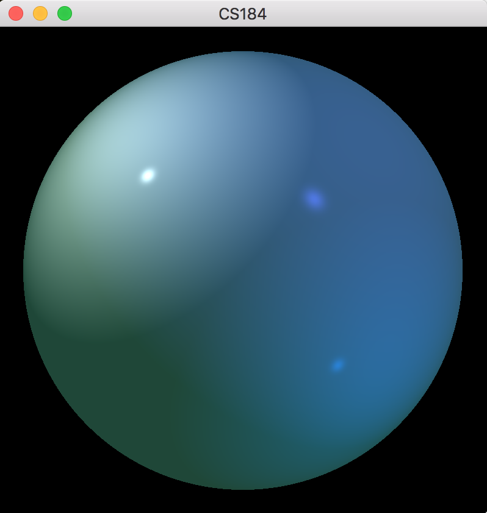

* An image showing combined specular and diffuse shading with one directional light source and three point light source on an isotrophic material. (-ks 0.5 0.5 0.5 -kd 0.5 0.5 0.5 -dl -1 -1 -1 1 1 1 -pl 1 0 1 0.8 0.2 0.8 -sp 2 -pl -1 -1 1 0.5 0.6 0.9 -pl -1 1 1 0.1 0.8 0.2)
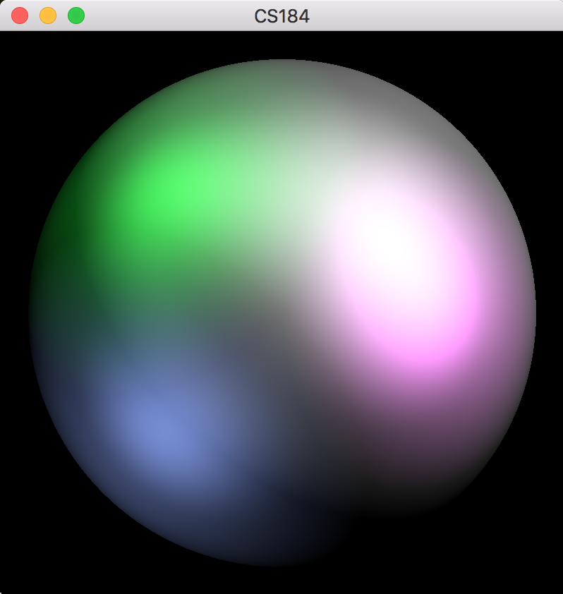

* An image showing combined specular and diffuse shading with one directional light source and one point light source on an Ashikhmin-Shirley material. (-ks .5 .5 .5 -kd .5 .5 .5 -spu 1 -spv 70 -dl -1 -1 -0.2 4 2 1 -pl -1 1 1 0.3 0.8 0.2 -asm)
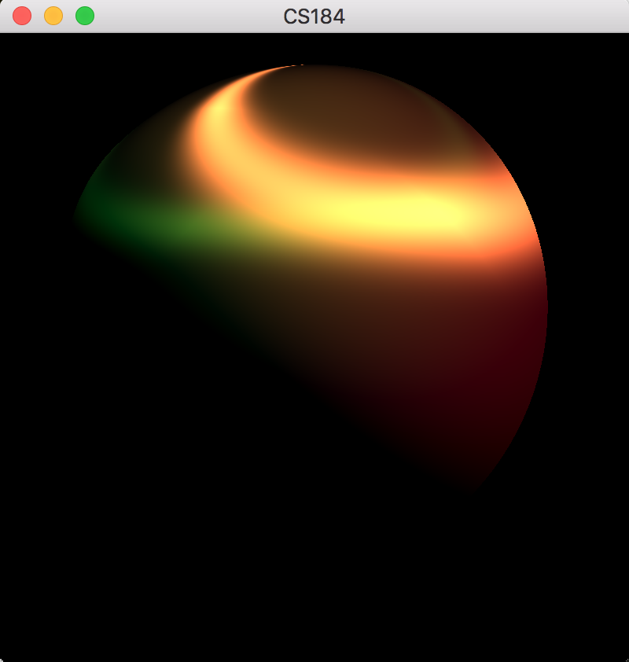

* An image showing combined ambient, specular and diffuse shading with two directional light source on an isotrophic material. (-kd 0.5 0.5 0.5 -ks 0.5 0.5 0.5 -sp 200 -dl -1 -1 -1 0.8 0 0.2 -dl 1 -1 -1 0.4 1 0 -ka 0.3 0.3 0.3)
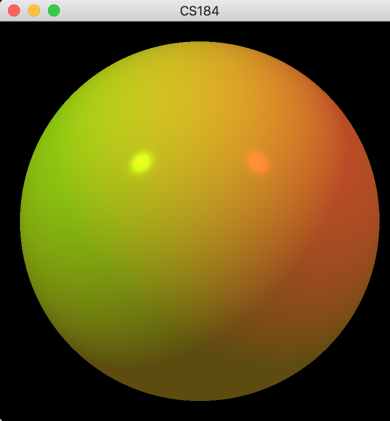

## Get Started

1. `cd basic-shading`
2. `mkdir build`
3. `cd build`
4. `cmake ..`
5. `make`
6. `./shader <options>`

## Command Line Options
* -ka r g b
    * This is the ambient color coefficients of the sphere material. The parameters r g b are numbers between 0 and 1 inclusive.
* -kd r g b
    * This is the diffuse color coefficients of the sphere material. The parameters r g b are numbers between 0 and 1 inclusive.
* -ks r g b
    * This is the specular color coefficients of the sphere material. The parameters r g b are numbers between 0 and 1 inclusive.
* -spu pu
    * This is the power coefficient on the specular term in the u direction for an anisotropic material. It is a number between 0 and max_float.
* -spv pv
    * This is the power coefficient on the specular term in the v direction for an anisotropic material. It is a number between 0 and max_float.
* -sp p
    * This is the power coefficient on the specular term for an isotropic material. It is a number between 0 and max_float. (i.e. the same as setting pu and pv the the same value.)
* -pl x y z r g b
    * This adds a point light to the scene. The x y z values are the location of the light. The r g b values are it's color. Note that the x y z values are relative to the sphere. That is, the center of the sphere is at the origin and the radius of the sphere defines one unit of length. The Y direction is UP, the X direction is to the right on the screen, and the Z direction is "in your face." The r g b value are between 0 and max_float, NOT between 0 and 1 (that is, the r g b values encode the brightness of the light).
* -dl x y z r g b
    * This adds a directional light to the scene. The x y z values are the direction that the light points in. The r g b values are it's color.
* -asm
    * Ashikhmin-Shirley materials

## Keyboard features
1. 'ESC': Exit
2. 'Q': Exit
3. 'F': Full screen
4. '↓': Translate objects down
5. '↑': Translate objects up
6. '←': Translate objects left
7. '→': Translate objects right
